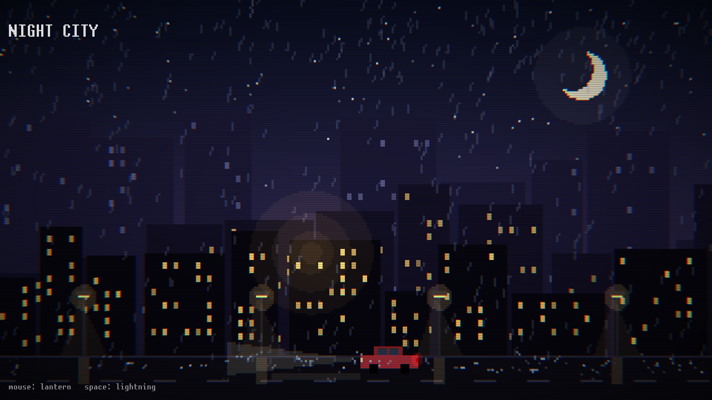

# terse-graphics (tgx)

[](https://github.com/twist347/terse-graphics/actions/workflows/linux.yml)
[](https://github.com/twist347/terse-graphics/actions/workflows/macos.yml)
[](https://github.com/twist347/terse-graphics/actions/workflows/windows.yml)

A small 2D-first graphics library on top of OpenGL 3.3 core, C++23: a window,
a loop and a canvas for games in the spirit of raylib, with the OpenGL level
underneath when you need your own shaders. Tested on Linux (NVIDIA, Mesa) and
macOS; on Windows it builds with MSVC and passes the CPU tests in CI, but has
not been run on a display yet. Early and moving: the API changes from commit
to commit.



*`examples/scenes/01_night_city`: a 320x180 render target, parallax, additive
light and a scanline shader, all made in code.*

## What there is

- **Window and loop**: one call to start, a GLFW-shaped loop, fullscreen,
  focus, a frame clock.
- **Input**: keys, mouse buttons, the wheel, typed text.
- **Canvas**: shapes, gradients, sprites and text in a built-in pixel font,
  under a 2D camera, batched into as few draws as the GPU allows.
- **Render targets**: pixel art scaled up crisp, post effects, screenshots.
- **Audio**: sounds and streamed music, WAV, OGG, MP3 or FLAC.
- **Images and textures**: PNG, JPEG, BMP, TGA, GIF in, PNG out.
- **Utilities**: GPU-ready math with glm's conventions, collisions, `Random`
  giving the same numbers on every platform.
- **`tgx::gl`**: your own shaders, typed buffers and uniforms, in the same
  frame as the canvas.
- **Checks**: asserts for the mistakes OpenGL keeps quiet about.

## Quick start

```cpp
#include "tgx/tgx.hpp"

int main() {
    auto app = tgx::App::create({.title = "hello"});
    if (!app) {
        return 1;
    }
    auto &canvas = app->canvas();
    tgx::Vec2 player{640, 360};

    while (!app->should_close()) {
        app->poll_events();
        player += app->input().direction() * 300 * app->clock().delta();

        canvas.clear(tgx::colors::dark_gray);
        canvas.rect_gradient({0, 0, 1280, 360}, tgx::colors::blue, tgx::colors::dark_gray);
        canvas.circle(player, 20, tgx::colors::yellow);
        canvas.text({20, 40}, "WASD or arrows to move", tgx::colors::white);

        app->swap_buffers();
    }
}
```

The [guide](docs/guide.md) explains how the parts fit together; every function
is documented in its header. What comes next: the [roadmap](docs/roadmap.md).

## Examples

Lessons, one idea each, in two folders by level: `examples/tgx/` uses only
`tgx::`, `examples/gl/` adds `tgx::gl::`. Each includes `tgx/tgx.hpp`, the one
header there is to include, and builds as `<folder>_<name>`, e.g.
`tgx_01_window`.

| `examples/tgx/` | Shows                                                              |
|-----------------|--------------------------------------------------------------------|
| `01_window`     | The bare loop: a window cleared to one color.                      |
| `02_shapes`     | The `Canvas` shapes, one call each: filled, outlined, see-through. |
| `03_texture`    | An `Image` made pixel by pixel, as a `Texture`, drawn as a sprite. |
| `04_sprite`     | The `Sprite` fields: part of an atlas, mirrored, tinted, turned.   |
| `05_moving`     | Movement by `clock().delta()`, the same at any frame rate.         |
| `06_camera`     | A camera following a player, and a HUD that stays put.            |
| `07_viewport`   | A minimap: the world again, in a corner, at its own scale.         |
| `08_blend`      | Alpha and additive blending side by side.                          |
| `09_input`      | Keyboard and mouse: held keys, presses, the wheel, the mouse in the world. |
| `10_text`       | Text in the built-in font: sizes, lines, centering, a field to type in. |
| `11_collision`  | Collision checks: a point in a shape, shapes overlapping, the part rects share. |
| `12_pixel_art`  | A render target: the world at 320x180, scaled up into sharp square pixels. |
| `13_audio`      | Notes made in code, played at five pitches and panned; music streamed from a file. |

| `examples/gl/`     | Shows                                                           |
|--------------------|-----------------------------------------------------------------|
| `01_triangle`      | Vertices in a buffer, a vertex array, a shader and a draw.      |
| `02_indexed`       | An index buffer.                                                |
| `03_uniforms`      | Uniforms: a color set once, a transform set every frame.        |
| `04_texture`       | A texture on a square: uvs, a sampler and a texture slot.       |
| `05_blend`         | Render state per draw: the same squares without and with blending. |
| `06_cube`          | 3D: perspective, a camera, depth test and back-face culling.    |
| `07_canvas_shader` | The `Canvas` drawing through a shader of your own.              |
| `08_post_process`  | A render target with depth, then the whole frame through a shader. |

Scenes put many parts together, for the look of it rather than one idea at a
time; everything in them is made in code, no files needed.

| `examples/scenes/` | Shows                                                          |
|--------------------|----------------------------------------------------------------|
| `01_night_city`    | Rain over a city in pixel art: parallax, light, lightning, a scanline shader. |

## Building

CMake 3.25+ and a C++23 compiler; every dependency is vendored in
`thirdparty/`. On Linux, GLFW also needs the system's Wayland and X11
headers:

```sh
# Debian, Ubuntu
sudo apt install libwayland-dev libxkbcommon-dev libx11-dev libxrandr-dev libxinerama-dev libxcursor-dev libxi-dev
# Fedora
sudo dnf install wayland-devel libxkbcommon-devel libX11-devel libXrandr-devel libXinerama-devel libXcursor-devel libXi-devel
```

```sh
cmake -S . -B build
cmake --build build
ctest --test-dir build
```

In another CMake project: `add_subdirectory(terse-graphics)`, or
`cmake --install` it and `find_package(tgx)`; then link `tgx::tgx`. Options
and the rest: [guide](docs/guide.md#building).

## License

zlib (see `LICENSE`): use it in anything, closed or commercial, and change it;
a game built with it owes no notice. The vendored code keeps its own terms:
GLFW under zlib, stb and the unscii font in the public domain, miniaudio in
the public domain or MIT-0, doctest (tests only) under MIT; glad's loader is
WTFPL or CC0, with parts from the Khronos registry under Apache-2.0. `cmake
--install` puts all of their licenses beside the library, in `share/doc`.
